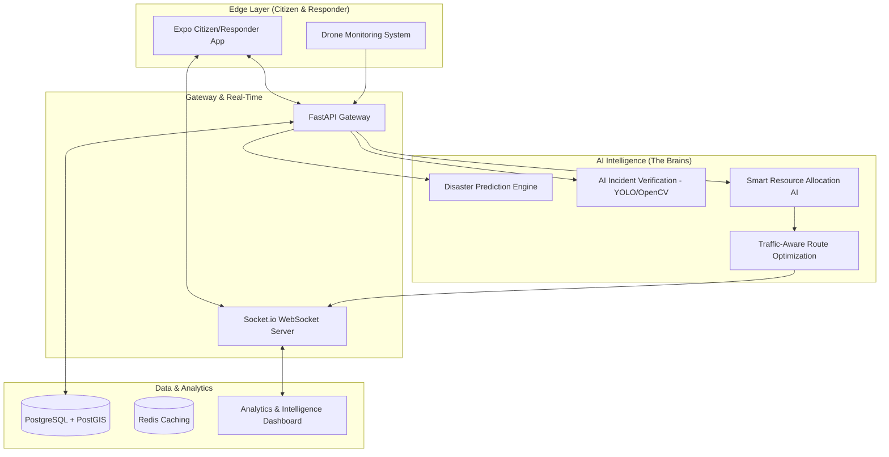
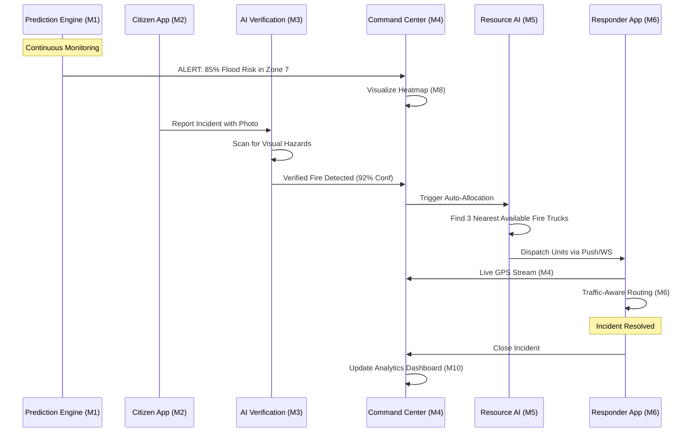

# AI-Powered Smart Disaster Intelligence & Response System (SDIRS)
## Technical Specification & Implementation Guide

SDIRS is an advanced, multi-layered ecosystem designed to transform disaster management from a reactive manual process into a proactive, AI-driven autonomous coordination platform.

---

## 1. System Architecture Diagram

---

## 2. Tech Stack & Their Strategic Uses

### **Backend Core: FastAPI (Python 3.14)**
*   **Use:** High-performance asynchronous API gateway.
*   **Why:** Handles concurrent connections from thousands of citizens and responders with minimal latency. Supports native Pydantic validation for strict data integrity.

### **Database: PostgreSQL + PostGIS Extension**
*   **Use:** Relational data storage with spatial intelligence.
*   **Why:** PostGIS allows SDIRS to perform complex geographical queries (e.g., "Find the nearest fire truck within 5km of this GPS coordinate") in milliseconds using R-tree spatial indexing.

### **Real-Time: Socket.io (WebSockets)**
*   **Use:** Bi-directional event-driven communication.
*   **Why:** Enables the **Emergency Command Center** to see live responder movements and incident updates without refreshing. Vital for Module 9 (Emergency Communication).

### **Computer Vision: OpenCV & YOLO (You Only Look Once)**
*   **Use:** Automated image analysis for Module 3.
*   **Why:** Automatically verifies if a citizen's photo actually contains "Fire" or "Flood," filtering out fake reports and calculating AI confidence scores.

### **Machine Learning: Scikit-Learn & TensorFlow**
*   **Use:** Predictive modeling for Modules 1 & 5.
*   **Why:** Random Forest models predict incident severity and resource demand based on weather snapshots and historical disaster frequency.

### **Frontend: React.js & Mapbox GL**
*   **Use:** Command Center Dashboard.
*   **Why:** Mapbox GL provides high-performance vector maps for visualizing disaster heatmaps and live tracking of hundreds of active units.

### **Mobile: React Native (Expo)**
*   **Use:** Citizen Reporting & Responder Navigation.
*   **Why:** A single codebase for iOS and Android that supports native hardware access (GPS, Camera, Accelerometer) required for field reporting.

---

## 3. Implementation of the 10 Core Modules

### **Module 1: Disaster Prediction Engine**
*   **How:** Combines OpenWeatherMap API data (rainfall, wind) with historical database records. A Scikit-learn model calculates a "Risk Probability" for specific GPS zones.
*   **Output:** Generates `disaster_predictions` entries with alert levels (Green/Yellow/Red).

### **Module 2: Citizen Reporting Network**
*   **How:** A multipart API in FastAPI that accepts GPS, text, and binary image uploads. 
*   **Storage:** Images are stored in a UUID-masked file system; metadata is indexed in PostGIS.

### **Module 3: AI Incident Verification System**
*   **How:** Triggered automatically upon incident creation. OpenCV analyzes the uploaded photo for visual patterns of disaster.
*   **Logic:** If `ai_confidence > 0.7`, the incident status is set to `verified`, bypassing manual triage.

### **Module 4: Real-Time Emergency Command Center**
*   **How:** A React dashboard that subscribes to Socket.io events. It renders live incident markers and responder icons using Leaflet/Mapbox.

### **Module 5: Smart Resource Allocation AI**
*   **How:** Uses the `ST_Distance` PostGIS function.
*   **Logic:** Matches `incident_severity` to `resource_capacity`. It identifies the $N$ nearest available units and automatically creates `allocations` records.

### **Module 6: Traffic-Aware Route Optimization**
*   **How:** Integrates Google Maps Directions API with an A* search algorithm for secondary route calculation in case of road closures (detected in Module 2).

### **Module 7: Drone Monitoring System**
*   **How:** Uses WebRTC or RTSP stream ingestion to provide live aerial feeds directly into the Command Center dashboard.

### **Module 8: Disaster Heatmap & Risk Visualization**
*   **How:** Uses `turf.js` or Mapbox Heatmap layers on the frontend to visualize high-risk clusters based on current predictions and active incidents.

### **Module 9: Emergency Communication System**
*   **How:** A dedicated WebSocket namespace for secure team-based chat. Supports "Command Broadcasts" that override all responder screens in critical alerts.

### **Module 10: Disaster Analytics & Intelligence**
*   **How:** A background worker aggregates `allocations` data (arrival time - dispatch time) to calculate the "Average Response Time" displayed in Recharts/D3.js.

---

## 4. Full Project Workflow (The Lifecycle of a Disaster)

---

## 5. Security & Reliability
1.  **JWT Authentication:** All responders and admins must authenticate using JSON Web Tokens.
2.  **Role-Based Access Control (RBAC):** Citizens can only report; Responders can only see assigned tasks; Admins control the entire system.
3.  **PostGIS Indexing:** Ensures the system remains fast even with 100,000+ historical records.
4.  **WebSocket Fallback:** If WebSockets fail, the system falls back to long-polling to maintain a live connection.
